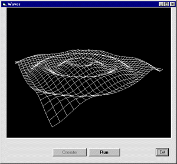



## Moving Waves Great Mathimatical Functions \!

### Description

This code uses many math functions to create moving waves it also shows how to use objects and such and such great if you are making a game Enjoy & Please Vote !!!
 
### More Info
 

             |
---                |---
**Submitted On**   |2000-10-04 00:41:04
**By**             |[Skull Hacker](https://github.com/Planet-Source-Code/PSCIndex/blob/master/ByAuthor/skull-hacker.md)
**Level**          |Advanced
**User Rating**    |5.0 (15 globes from 3 users)
**Compatibility**  |VB 6\.0
**Category**       |[Math/ Dates](https://github.com/Planet-Source-Code/PSCIndex/blob/master/ByCategory/math-dates__1-37.md)
**World**          |[Visual Basic](https://github.com/Planet-Source-Code/PSCIndex/blob/master/ByWorld/visual-basic.md)
**Archive File**   |[Moving\_Wav14567510132002\.zip](https://github.com/Planet-Source-Code/skull-hacker-moving-waves-great-mathimatical-functions__1-39794/archive/master.zip)

